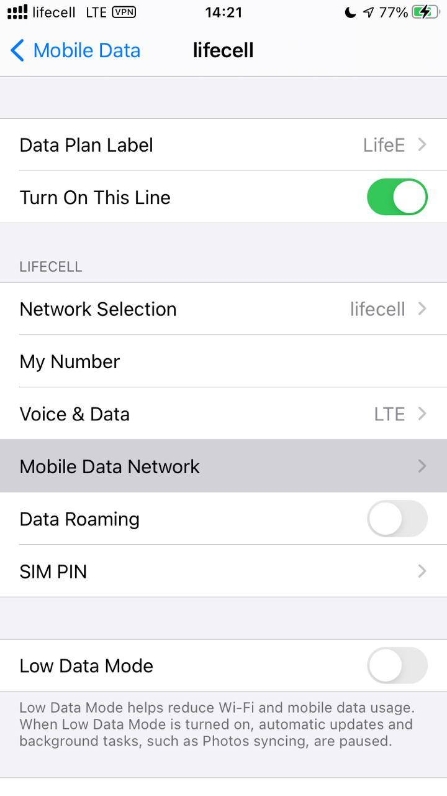
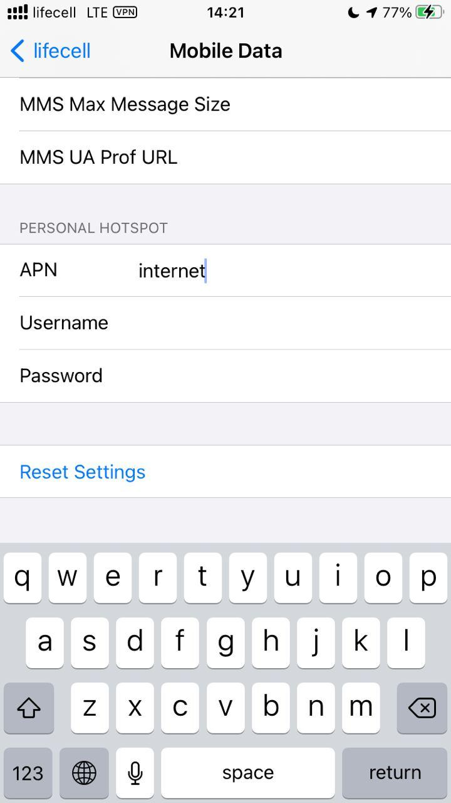

# iOS

Primarly iPhone SE 2020 with iOS 14.0.1

## Apps (open-source)

- [iSH](https://ish.app/) — Alpine Linux i686 container with filesystem access via Files app
- [KeePassium](https://apps.apple.com/pl/app/keepassium-keepass-passwords/id1435127111) — KeePass compatible password manager, 2FA
- [Raivo OTP](https://apps.apple.com/pl/app/raivo-otp/id1459042137) — 2FA (I recommend KeePassium instead)
- [Unstoppable Wallet](https://apps.apple.com/app/bank-bitcoin-wallet/id1447619907) — Bitcoin, Ethereum and other crypto
- [Monero Wallet WooKey](https://apps.apple.com/by/app/monero-wallet-wookey/id1458831417) — Monero wallet
- [//afone](https://apps.apple.com/pl/app/afone/id1470424336) — SIP (VoIP) client with minimalistic design
- [AdGuard](https://apps.apple.com/app/apple-store/id1047223162) — Adblocker for Safari with customizable filter lists
- ~~[Nicegram](https://apps.apple.com/app/id1457369322) — Telegram client with advanced features~~

## Troubleshooting

KeePass database sync over SSH

Use iSH and rsync (set short aliases in your shell for uploading and downloading database)

Personal Hotspot is missing in Settings

Settings → Mobile Data → _Your data plan here_ → Mobile Data Network

Fill your operator APN settings into **Peronal Hotspot** section. Usually it's just `internet` without login and password).

Then re-enable broadband (airplane mode on then off) and here you go!

YouTube background/PiP mode

1. download Firefox from App Store
2. open any Youtube link in it
3. enable the Desktop version from Firefox context menu
4. switch to full screen video
5. tap on PiP mode icon

